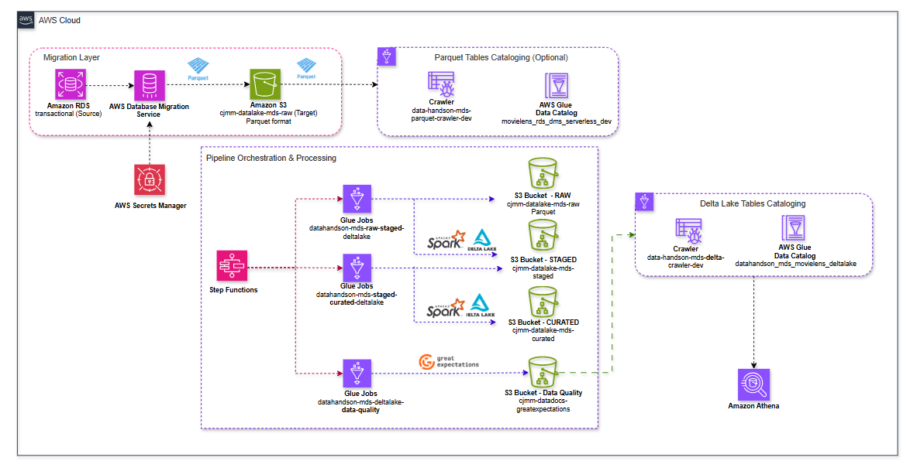

# Data Lakehouse Serverless - AWS

Arquitetura de Data Lakehouse na AWS com Delta Lake, processando dados do dataset MovieLens através de um pipeline ETL completo seguindo a arquitetura Medallion.

## Arquitetura

<p align="center">
  
</p>

### Camadas Medallion

| Camada | Bucket | Formato | Descrição |
|--------|--------|---------|-----------|
| **Raw** | `cjmm-datalake-mds-raw` | Parquet | Dados brutos do RDS via DMS |
| **Staged** | `cjmm-datalake-mds-staged` | Delta Lake | Dados limpos e deduplicados |
| **Curated** | `cjmm-datalake-mds-curated` | Delta Lake | Dados agregados para analytics |

```
RDS PostgreSQL → DMS → Raw (Parquet) → Staged (Delta) → Curated (Delta) → Athena
```

## Stack

- **Infraestrutura:** Terraform
- **Ingestão:** AWS DMS Serverless
- **Storage:** Amazon S3
- **Processamento:** AWS Glue (Spark) + Delta Lake
- **Orquestração:** AWS Step Functions
- **Catalogação:** AWS Glue Data Catalog
- **Data Quality:** Great Expectations
- **Analytics:** Amazon Athena

## Estrutura

```
├── terraform/infra/
│   ├── main.tf
│   ├── modules/
│   │   ├── vpc/
│   │   ├── rds/
│   │   ├── dms-serverless/
│   │   ├── glue-job/
│   │   ├── glue-crawler-delta/
│   │   ├── glue-crawler-parquet/
│   │   └── step-functions/
│   └── scripts/
│       ├── glue_etl/
│       └── step-functions-definitions/
├── database_postgres/
│   ├── ml-latest-small/
│   └── postgres_aws_migration_data_s3/
└── code/glue-jobs/
```

## Setup

### Pré-requisitos

- AWS CLI configurado
- Terraform >= 1.0
- Python 3.9+

### Deploy

```bash
# Configurar profile AWS
aws configure --profile projeto-lakehouse-serverless

# Inicializar e aplicar Terraform
cd terraform/infra
terraform init -backend-config="backends/develop.hcl"
terraform apply -var-file=envs/develop.tfvars
```

### Executar Pipeline

1. Iniciar Step Functions via console AWS
2. Executar Crawler Delta:

```bash
aws glue start-crawler \
  --name data-handson-mds-dev-delta-crawler \
  --profile projeto-lakehouse-serverless
```

## Tabelas

| Database | Tabela | Descrição |
|----------|--------|-----------|
| `datahandson_mds_movielens_deltalake` | `movie_ratings` | Ratings agregados por filme |
| `datahandson_mds_movielens_deltalake` | `user_tags` | Tags por usuário |

### Queries Athena

```sql
-- Top filmes
SELECT title, avg_rating, genres
FROM datahandson_mds_movielens_deltalake.movie_ratings
ORDER BY avg_rating DESC
LIMIT 10;

-- Tags populares
SELECT tag, COUNT(*) as total
FROM datahandson_mds_movielens_deltalake.user_tags
GROUP BY tag
ORDER BY total DESC
LIMIT 20;
```

## Configurações Delta Lake

```hcl
# Crawler Delta - tabelas nativas
delta_target {
  delta_tables              = var.delta_tables
  write_manifest            = false
  create_native_delta_table = true
}
```

```hcl
# Glue Jobs
additional_arguments = {
  "--enable-glue-datacatalog" = "true"
  "--datalake-formats"        = "delta"
  "--conf" = "spark.sql.extensions=io.delta.sql.DeltaSparkSessionExtension"
}
```

## Data Quality

Validações com Great Expectations:
- Schema validation
- Null checks
- Range validation
- Uniqueness checks
- Relatórios em S3

## Autora

**Vanessa Prado** - [GitHub](https://github.com/euvanessa-prado)
